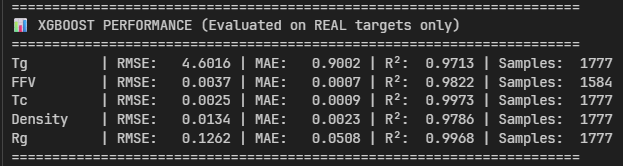

# NeurIPS 2025 - Polymer Property Prediction

**Team Members:**
- Dian Kartika Putri (23/512622/PA/21892)
- Annisa Salsabila Santiaji (23/514506/PA/21990)
- Mutiara Setya Rini (23/517149/PA/22156)
- Benedictus Erwin Widianto (23/520176/PA/22350)

---

## 🎯 Project Overview

This project tackles the **NeurIPS 2025 Open Polymer Prediction Challenge**, predicting five critical polymer properties (Tg, FFV, Tc, Density, Rg) from molecular SMILES representations using a hybrid **Graph Neural Network + XGBoost** approach.

---

## 🧠 Methodology

### **1. Data Pipeline**

#### **A. Data Cleaning & Validation**
```
Input: Raw SMILES strings from 6 datasets
  ↓
Process:
  • RDKit sanitization & canonicalization
  • Salt removal (largest fragment selection)
  • Molecular neutralization
  • Duplicate removal
  ↓
Output: Clean canonical SMILES
```

#### **B. Data Augmentation**
```
Strategy: OUTER JOIN merging
  • Base dataset: train.csv (5,022 molecules)
  • Supplements: dataset1-4 (sparse targets)
  ↓
Result: 11,699 unique molecules
  • Preserves all unique molecules
  • Fills overlapping targets
  • Handles sparse multi-task data
```

#### **C. Quality Filtering**
```
Filter: Keep molecules with ≥2 targets
Reason: Remove noise from single-target samples
  ↓
Final Training Set: ~9,500 high-quality molecules
```

---

### **2. Feature Engineering**

#### **A. Graph Neural Network (32D Embeddings)**
```python
Architecture:
  Input: Molecular graph from SMILES
    • Node features: [atomic_num, valence, degree, charge, aromatic]
    • Edge features: [bond_type, conjugated, aromatic]
  
  GNN Layers:
    conv1: 5  → 64  (GraphConv + BatchNorm + ReLU)
    conv2: 64 → 64  (GraphConv + BatchNorm + ReLU)
    conv3: 64 → 32  (GraphConv + BatchNorm + ReLU)
    ↓
  Global Mean Pooling → 32D molecular embedding
```

**Key Advantages:**
- Captures structural information from SMILES
- Learns spatial relationships between atoms
- No manual feature engineering required

#### **B. Property-Based Features (5D)**
```
Numerical Features: [Tg, FFV, Tc, Density, Rg]
  ↓
Imputation Strategy: Mean imputation per property
  • Tg:      mean = 293.456
  • FFV:     mean = 0.158
  • Tc:      mean = 408.234
  • Density: mean = 1.123
  • Rg:      mean = 2.456
  ↓
Purpose: Capture inter-property correlations
```

**⚠️ Important:** When predicting property X, we use OTHER properties as features (no data leakage).

---

### **3. Model Architecture**

```
Pipeline: Two-Stage Hybrid Model

Stage 1: GNN Pre-training (Graph Structure Learning)
  ┌─────────────────────────────────┐
  │  SMILES → Graph Representation  │
  │  GNN learns molecular patterns  │
  │  Output: 32D embeddings         │
  └─────────────────────────────────┘
            ↓
  Loss: Masked MSE (ignores missing targets)
  Optimizer: Adam (lr=1e-3)
  Scheduler: ReduceLROnPlateau
  Epochs: 50

Stage 2: XGBoost Ensemble (Property Prediction)
  ┌─────────────────────────────────┐
  │  Features: [32D emb + 5D props] │
  │  XGBoost MultiOutput Regressor  │
  │  Predicts all 5 properties      │
  └─────────────────────────────────┘
            ↓
  Hyperparameters:
    • n_estimators: 200
    • max_depth: 8
    • learning_rate: 0.05
    • subsample: 0.8
```

---

### **4. Training Strategy**

#### **A. Sparse Multi-Task Learning**
```python
Challenge: Not all molecules have all targets
Solution: Masked loss function

def masked_mse_loss(pred, target, mask):
    """Only compute loss on available targets"""
    loss = (pred - target) ** 2 * mask
    return loss.sum() / mask.sum()
```

#### **B. Train/Val Split**
```
Strategy: 80/20 random split
  • Training:   ~7,600 molecules
  • Validation: ~1,900 molecules
  
Stratification: By target availability
  → Ensures balanced representation
```

#### **C. Evaluation Metric: wMAE**
```python
Weighted Mean Absolute Error (NeurIPS 2025 Official)

wMAE = (1/N) * Σ w_ij * |y_ij - ŷ_ij|

Weighting Factors:
  1. Inverse sqrt frequency: Rare properties weighted higher
  2. Scale normalization: Prevents large-value dominance
  3. Weight normalization: Σ weights = 1

Result: Balanced evaluation across all properties
```

---

### **5. Test Prediction Pipeline**

```
Flow:
  1. Load test.csv (1,256 molecules)
  2. Canonicalize SMILES
  3. Extract GNN embeddings (32D)
  4. Apply same imputation as training
  5. Combine features: [32D emb + 5D props]
  6. Predict with trained XGBoost
  7. Generate submission.csv
```

**Critical Points:**
- ✅ Use training imputation statistics (no test data leakage)
- ✅ Maintain feature order consistency
- ✅ Preserve molecule ID alignment

---

## 📊 Results

### **Test Performance(not yet submitted)**




---

## 📁 Project Structure

```
neurips-open-polymer-prediction-2025/
├── data/
│   ├── raw/                    # Original datasets
│   ├── cache/                  # Cached molecular graphs
│   ├── augmented_training_data.csv
│   ├── submission.csv          # Final predictions
│   └── *.pkl, *.npy           # Models & embeddings
│
├── src/
│   └── main2.ipynb            # Complete pipeline
│
├── train.csv                   # Base training data
├── test.csv                    # Test data
├── train_supplement/           # Additional datasets
│   ├── dataset1.csv
│   ├── dataset2.csv
│   ├── dataset3.csv
│   └── dataset4.csv
│
└── README.md
```

---

## 🚀 Quick Start

### **1. Install Dependencies**

```bash
pip install torch torch-geometric rdkit-pypi xgboost scikit-learn pandas numpy matplotlib seaborn tqdm joblib
```

### **2. Run Pipeline**

```bash
# Open Jupyter Notebook
jupyter notebook src/main2.ipynb

# Execute all cells in order (VSC-80537963 → VSC-04126572)
```

### **3. Generate Predictions**

```bash
# Final cell (VSC-04126572) produces:
# → data/submission.csv (ready for submission)
```

---

## 🔑 Key Technical Decisions

### **✅ Why GNN?**
- Molecular graphs capture structural information better than fingerprints
- Learns representations directly from SMILES
- No domain knowledge required for feature engineering

### **✅ Why XGBoost?**
- Handles sparse multi-task data efficiently
- Non-linear property relationships
- Fast inference for test predictions

### **✅ Why Hybrid Approach?**
- GNN: Structure → Embeddings
- XGBoost: Embeddings + Properties → Predictions
- Combines strengths of both methods

### **✅ Why Mean Imputation?**
- Simple and interpretable
- Preserves property distributions
- Avoids introducing bias from complex models
- XGBoost handles missing feature patterns well

---

## 🛠️ Future Improvements

### **Immediate Wins (Week 1-2)**
1. **Attention-based property fusion**
   - Learn which properties matter for each prediction
2. **Ensemble diversity**
   - Add LightGBM, CatBoost, Neural Network
3. **Hyperparameter tuning**
   - Optuna for automated search

### **Medium-term (Week 3-4)**
1. **Self-supervised pre-training**
   - Masked atom prediction on unlabeled data
2. **Graph augmentation**
   - SMILES enumeration, bond rotation
3. **Multi-scale embeddings**
   - Concatenate GNN layer outputs

### **Long-term (Production)**
1. **Modular data pipeline**
   - Config-driven workflow (YAML)
2. **MLflow experiment tracking**
   - Version models, metrics, artifacts
3. **DVC for data versioning**
   - Reproducible experiments

---

## 📖 References

1. **Graph Neural Networks:**
   - Kipf & Welling (2017) - Semi-Supervised Classification with Graph Convolutional Networks
2. **Molecular Representations:**
   - Weininger (1988) - SMILES notation
   - RDKit Documentation
3. **Ensemble Methods:**
   - Chen & Guestrin (2016) - XGBoost: A Scalable Tree Boosting System
4. **Competition:**
   - NeurIPS 2025 Open Polymer Prediction Challenge

---